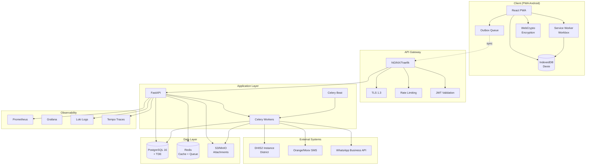
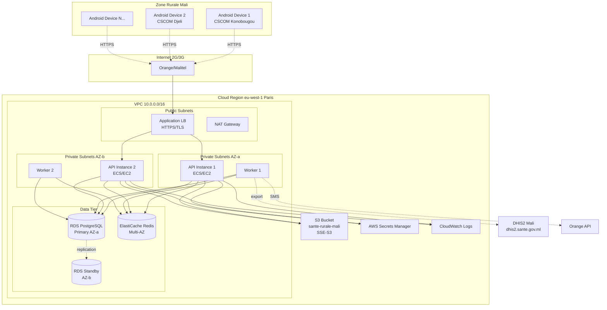
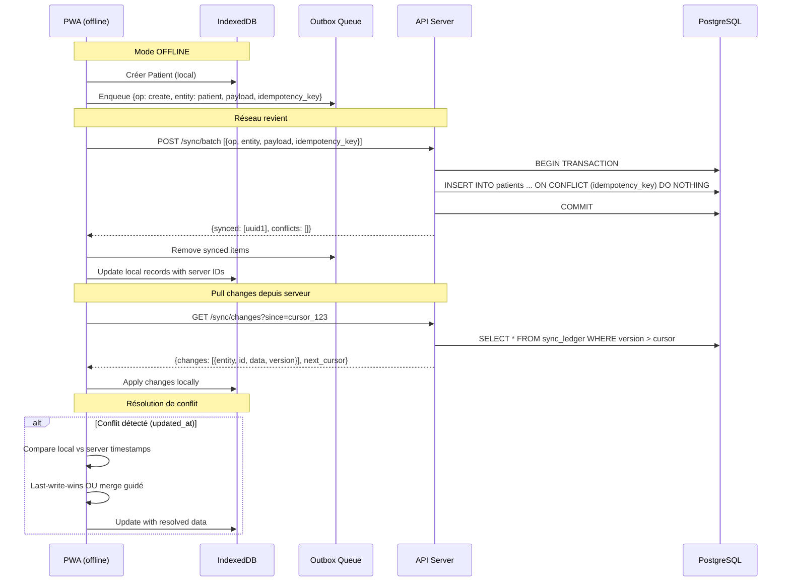
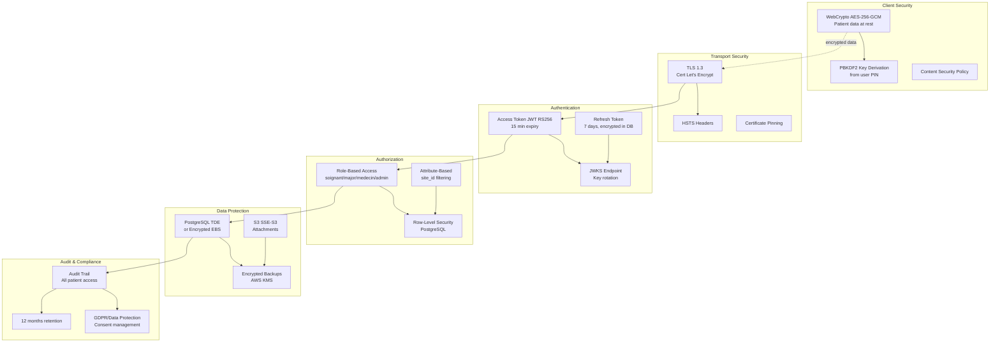
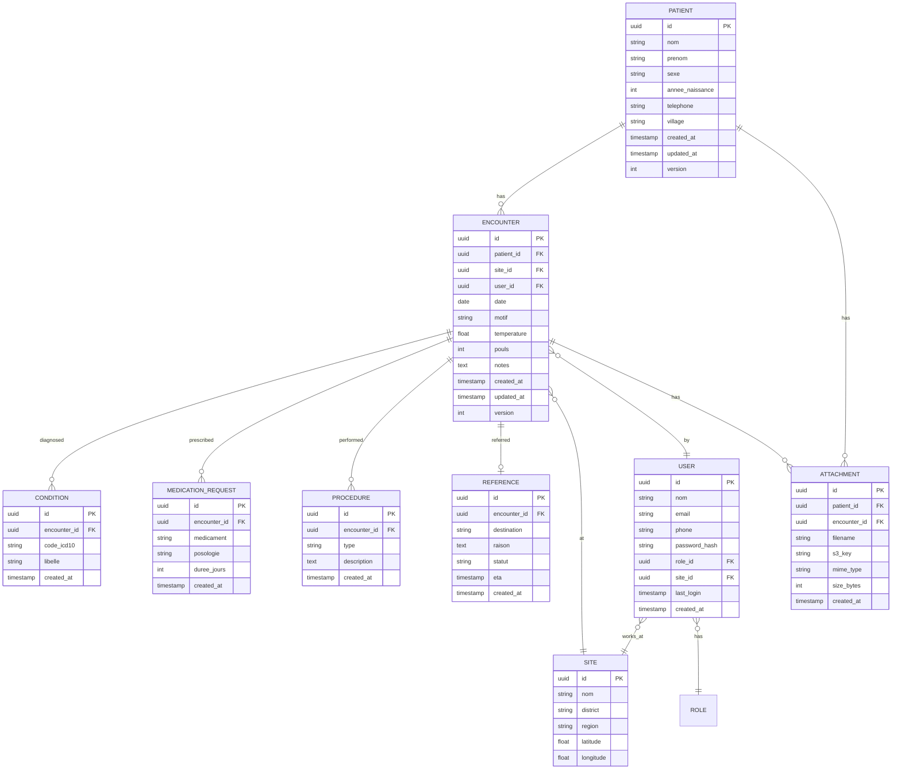

# Architecture PWA Santé Rurale Mali

## Vue d'ensemble

Cette architecture cible une PWA offline-first pour zones rurales au Mali avec connectivité intermittente (2G/3G).

## 1. Architecture Logique

## 2. Architecture de Déploiement (Production)

## 3. Flux de Synchronisation Offline

## 4. Architecture de Sécurité

## 5. Modèle de Données Conceptuel

## 6. Stack Technologique

### Frontend (PWA)
- **Framework**: React 18 + TypeScript
- **Build**: Vite 5
- **Offline**: Workbox 7 (Service Worker)
- **State**: Zustand + React Query
- **DB locale**: Dexie.js (IndexedDB wrapper)
- **UI**: TailwindCSS + Headless UI
- **Forms**: React Hook Form + Zod validation
- **i18n**: react-i18next
- **Monitoring**: Sentry Browser SDK
- **Camera**: react-webcam

### Backend (API)
- **Framework**: FastAPI 0.109+ (Python 3.11+)
- **ASGI Server**: Uvicorn + Gunicorn
- **ORM**: SQLAlchemy 2.0 + Alembic migrations
- **Validation**: Pydantic v2
- **Auth**: python-jose (JWT), passlib (bcrypt)
- **Tasks**: Celery 5 + Redis broker
- **OpenAPI**: Auto-generated par FastAPI
- **Monitoring**: OpenTelemetry + Prometheus client

### Data
- **Primary DB**: PostgreSQL 16 (RDS Multi-AZ)
- **Cache/Queue**: Redis 7 (ElastiCache)
- **Object Storage**: S3 (ou MinIO local)
- **Search**: PostgreSQL Full-Text Search (pg_trgm)

### Infrastructure
- **Container**: Docker + Docker Compose (dev)
- **Orchestration**: AWS ECS Fargate (ou K3s si budget serré)
- **IaC**: Terraform 1.6+
- **CI/CD**: GitHub Actions
- **DNS**: Route53 + CloudFront (CDN PWA)
- **Secrets**: AWS Secrets Manager
- **Monitoring**: Grafana Cloud ou self-hosted (Prometheus + Grafana + Loki)

## 7. Exigences de Performance

| Métrique | Objectif | Mesure |
|----------|----------|---------|
| PWA TTI (3G) | < 3s | Lighthouse |
| API Response P95 | < 1s | Prometheus |
| API Response P99 | < 2s | Prometheus |
| Sync batch (100 records) | < 10s | E2E tests |
| Offline operation | < 60s consultation | User testing |
| Cache hit ratio | > 90% | Redis metrics |
| DB query P95 | < 100ms | pg_stat_statements |
| Uptime SLA | 99.5% | StatusPage |

## 8. Dimensionnement Initial

**Hypothèses**:
- 50 CSCOM pilotes
- 2-3 agents par CSCOM
- 30 consultations/jour/CSCOM
- Pic : 10 consultations/heure

**Resources**:
- API: 2x t3.medium (2 vCPU, 4 GB) + auto-scaling
- DB: db.t4g.medium (2 vCPU, 4 GB, 100 GB gp3)
- Redis: cache.t4g.micro (2 GB)
- Workers: 2x t3.small
- S3: 10 GB/mois (photos/PDFs)
- Bandwidth: ~100 GB/mois

**Coût estimé AWS**: ~300-400 USD/mois

## 9. Plan de Reprise (DR)

- **RTO**: 4 heures
- **RPO**: 1 heure
- **Backups**:
  - PostgreSQL: automated snapshots quotidiens + PITR
  - S3: versioning activé + réplication cross-region (optionnel)
  - Rétention: 30 jours
- **Restauration**: procédure testée mensuellement
- **Failover**: RDS Multi-AZ automatique

## 10. Roadmap Scalabilité

### Phase 1 (MVP - 50 sites)
- Architecture actuelle suffisante

### Phase 2 (500 sites)
- Lecture replicas PostgreSQL
- Redis Cluster (vs standalone)
- CDN CloudFront pour assets PWA
- Partitionnement DB par région

### Phase 3 (5000+ sites)
- Multi-region déploiement
- Sharding DB par district
- Kafka pour event streaming
- Microservices (patients, encounters, exports)
