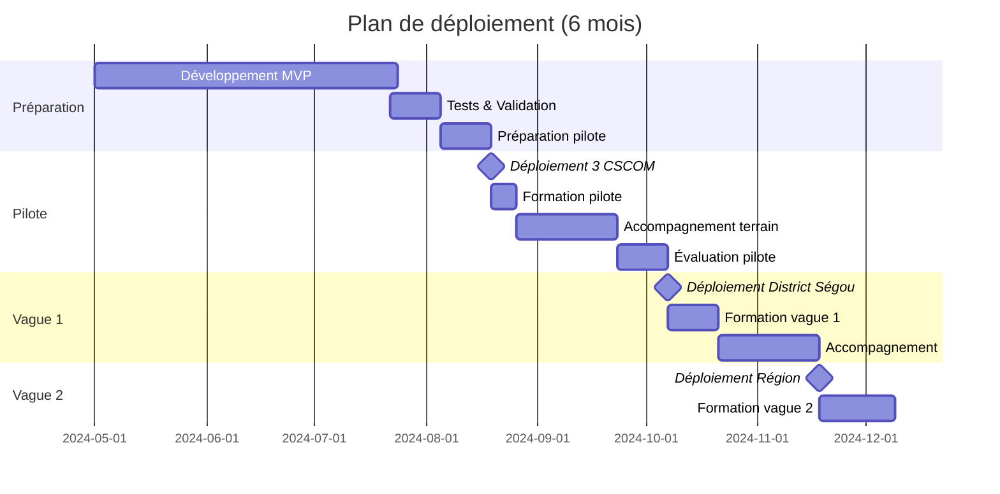
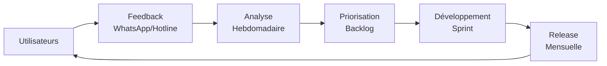

# Plan de Déploiement & Formation - Santé Rurale Mali

## Table des matières

1. [Stratégie de déploiement](#stratégie-de-déploiement)
2. [Phase pilote](#phase-pilote)
3. [Formation des utilisateurs](#formation-des-utilisateurs)
4. [Montée en charge](#montée-en-charge)
5. [Mesure d'impact](#mesure-dimpact)
6. [Support & Accompagnement](#support--accompagnement)

---

## Stratégie de déploiement

### Approche progressive

**Principe**: Déploiement progressif par vagues pour minimiser les risques et maximiser l'apprentissage.



### Critères de passage entre phases

| Phase | Critère de succès | Seuil |
|-------|-------------------|-------|
| Pilote → Vague 1 | Taux d'adoption | ≥ 80% des soignants utilisent l'app quotidiennement |
| | Satisfaction | Score NPS ≥ 40 |
| | Qualité données | < 5% d'erreurs de saisie |
| | Performance technique | Sync success rate ≥ 95% |
| Vague 1 → Vague 2 | Idem + Capacité support | Tickets résolus en < 48h dans 90% des cas |

---

## Phase pilote

### Sélection des sites pilotes

**Critères de sélection**:
- ✅ Représentativité: zone rurale, connectivité 2G/3G intermittente
- ✅ Taille moyenne: 3000-5000 habitants desservis
- ✅ Motivation: équipe volontaire et engagée
- ✅ Accessibilité: < 3h de route depuis Bamako/Ségou (pour accompagnement)

**Sites pilotes proposés** (3):
1. **CSCOM Konobougou** (District Ségou)
   - Population: 4500
   - Personnel: 1 médecin, 2 infirmiers, 1 sage-femme
   - Connectivité: 3G Orange (intermittente)

2. **CSCOM Novou-Tamala** (District Ségou)
   - Population: 3200
   - Personnel: 3 infirmiers, 1 major
   - Connectivité: 2G Malitel

3. **CSCOM Djeli** (District Ségou)
   - Population: 2800
   - Personnel: 2 infirmiers, 1 matrone
   - Connectivité: 3G Orange/Malitel

### Préparation du pilote

**T-2 semaines** (avant déploiement):

- [ ] **Matériel**:
  - 2-3 smartphones Android par site (Samsung A14 ou équivalent, 4GB RAM min)
  - Chargeurs + powerbanks
  - Étuis de protection renforcés
  - Cartes SIM (Orange + Malitel pour redondance)

- [ ] **Infrastructure**:
  - Créer les comptes utilisateurs dans le système
  - Configurer les sites dans la base de données
  - Générer les identifiants de connexion
  - Tester la connexion depuis les sites (VPN si nécessaire)

- [ ] **Communication**:
  - Réunion de lancement avec les directeurs de district
  - Lettre d'information aux majors des CSCOM
  - Affiche d'information pour les équipes

**T-1 semaine**:

- [ ] Visite terrain pour installer l'application
- [ ] Test de connexion et de synchronisation
- [ ] Vérification de la réception SMS (si applicable)

### Formation pilote

**Durée**: 1/2 journée par site (4 heures)

**Lieu**: Dans le CSCOM (formation au plus près du terrain)

**Participants**: Tous les soignants (médecin, infirmiers, sages-femmes, major)

**Formateurs**: 2 personnes (1 tech + 1 santé)

**Programme** (4 heures):

| Heure | Module | Durée | Contenu |
|-------|--------|-------|---------|
| 8h00 | Accueil | 15 min | Présentation, objectifs, tour de table |
| 8h15 | Démonstration | 30 min | Tour guidé de l'application |
| 8h45 | Connexion | 15 min | Se connecter / Se déconnecter |
| 9h00 | **TP1: Patients** | 45 min | Créer, rechercher, consulter un dossier |
| 9h45 | Pause | 15 min | - |
| 10h00 | **TP2: Consultations** | 60 min | Enregistrer une consultation complète (signes vitaux, diagnostic, ordonnance) |
| 11h00 | **TP3: Mode offline** | 30 min | Simuler une panne réseau, travailler offline, synchroniser |
| 11h30 | **TP4: Rapports** | 15 min | Consulter les statistiques, exporter |
| 11h45 | Q&A et troubleshooting | 15 min | Questions, problèmes rencontrés |
| 12h00 | Fin | - | Remise des supports (guide papier + vidéo) |

**Supports de formation**:

1. **Guide papier A5 plastifié** (20 pages):
   - Fiches de référence rapide (1 page/fonctionnalité)
   - Captures d'écran annotées
   - FAQ (10 questions fréquentes)
   - Contacts support

2. **Vidéos de formation** (5-7 min chacune):
   - Créer un patient (FR + voix-off Bambara)
   - Enregistrer une consultation
   - Travailler en mode offline
   - Résoudre les problèmes courants

3. **Jeu de données de test**:
   - 10 patients fictifs pré-créés
   - Scénarios de consultation guidés

### Accompagnement terrain (4 semaines)

**Semaine 1**: Présence quotidienne sur site (1 formateur/site)
- Assistance en temps réel pendant les consultations
- Résolution des blocages immédiats
- Collecte des premiers feedbacks

**Semaine 2-3**: Visite 2x/semaine
- Suivi de l'usage (dashboards)
- Sessions de Q&A
- Formation complémentaire si besoins identifiés

**Semaine 4**: Visite 1x/semaine + support WhatsApp
- Évaluation formative
- Préparation de l'évaluation finale

### Évaluation du pilote

**Méthodes**:

1. **Quantitative** (métriques système):
   - Nombre d'utilisateurs actifs quotidiens
   - Nombre de patients créés
   - Nombre de consultations enregistrées
   - Taux de synchronisation réussie
   - Temps moyen d'enregistrement d'une consultation
   - Erreurs techniques (logs)

2. **Qualitative** (interviews semi-structurées):
   - Satisfaction générale (échelle 1-5)
   - Facilité d'utilisation (System Usability Scale - SUS)
   - Gain de temps perçu
   - Difficultés rencontrées
   - Suggestions d'amélioration

3. **Observation directe**:
   - Temps réel de saisie d'une consultation (chronomètre)
   - Erreurs de manipulation
   - Contournements (workarounds)

**Rapport d'évaluation** (Semaine 6):
- Résumé exécutif (2 pages)
- Métriques clés (1 page dashboard)
- Retours utilisateurs (synthèse)
- Recommandations pour ajustements
- Décision Go/No-Go pour vague 1

---

## Formation des utilisateurs (Vagues suivantes)

### Formation de formateurs (ToT)

**Objectif**: Créer une équipe de formateurs locaux (district) pour assurer la montée en charge

**Participants**: 2 personnes par district (1 tech + 1 soignant expérimenté)

**Durée**: 2 jours

**Programme**:
- Jour 1: Maîtrise approfondie de l'application
  - Fonctionnalités avancées
  - Troubleshooting technique
  - Gestion des cas d'usage complexes
- Jour 2: Pédagogie et animation
  - Techniques d'animation de formation
  - Gestion des questions difficiles
  - Pratique (simulations de formation)

**Certification**: QCM + mise en situation pratique

### Formation standard (Vague 1+)

**Format**: Formation en cascade par district

**Durée**: 1/2 journée (4h)

**Ratio**: 1 formateur pour 10 participants max

**Programme**: Idem formation pilote (adapté selon retours)

---

## Montée en charge

### Vague 1: District de Ségou (25 CSCOM)

**Timeline**: Semaines 11-18 (8 semaines)

**Approche**:
- Formation par groupes de 5 CSCOM/semaine
- 5 formateurs déployés en parallèle
- Support centralisé (WhatsApp + hotline)

**Jalons**:
- Semaine 11-12: Formation groupe 1-2 (10 CSCOM)
- Semaine 13-14: Formation groupe 3-4 (10 CSCOM)
- Semaine 15-16: Formation groupe 5 + rattrapage (5 CSCOM)
- Semaine 17-18: Consolidation + évaluation

### Vague 2: Région de Ségou (80 CSCOM)

**Timeline**: Semaines 19-30 (12 semaines)

**Approche**: Idem Vague 1 avec montée en puissance

### Vague 3+: Autres régions

À planifier selon succès Vague 2 et capacité opérationnelle

---

## Mesure d'impact

### KPI d'usage

| KPI | Définition | Cible | Fréquence mesure |
|-----|------------|-------|------------------|
| Taux d'adoption | % soignants utilisant l'app ≥ 1x/jour | ≥ 80% | Hebdomadaire |
| Complétude dossiers | % consultations avec diagnostic + ordonnance | ≥ 90% | Mensuelle |
| Qualité données | % champs obligatoires remplis | ≥ 95% | Mensuelle |
| Sync success rate | % opérations synchronisées avec succès | ≥ 95% | Temps réel |
| Temps saisie consultation | Temps médian (minutes) | < 5 min | Mensuelle |

### KPI d'impact sanitaire

| KPI | Définition | Cible | Fréquence mesure |
|-----|------------|-------|------------------|
| Continuité des soins | % patients avec ≥ 2 consultations | ≥ 30% | Trimestrielle |
| Références complétées | % références avec statut "Complété" | ≥ 70% | Mensuelle |
| Rapports DHIS2 | % exports DHIS2 réussis dans les délais | 100% | Mensuelle |
| Détection précoce | Délai moyen diagnostic → référence (jours) | < 2 jours | Trimestrielle |

### Dashboard de monitoring

**Accès**: Tableau de bord Grafana public (lecture seule)

**Vues**:
1. Vue d'ensemble (KPI agrégés)
2. Vue par district
3. Vue par CSCOM
4. Tendances temporelles

---

## Support & Accompagnement

### Canaux de support

| Canal | Public | Disponibilité | SLA |
|-------|--------|---------------|-----|
| **WhatsApp Groupe Support** | Tous utilisateurs | 8h-18h (jours ouvrables) | Réponse < 2h |
| **Hotline téléphone** | Urgences uniquement | 8h-20h | Réponse immédiate |
| **Email support@** | Questions non urgentes | 24/7 | Réponse < 24h |
| **Visite terrain** | Sur demande major | À planifier | Sous 1 semaine |

### Base de connaissances

**FAQ en ligne** (accessible offline dans l'app):
- 50+ questions/réponses
- Vidéos tutoriels
- Guides de dépannage illustrés

**Mise à jour**: Mensuelle (enrichissement continu)

### Amélioration continue

**Cycle de feedback**:



**Réunion mensuelle** avec les champions (1 par district):
- Retours terrain
- Présentation des nouvelles fonctionnalités
- Co-construction des évolutions

---

## Annexes

### Annexe A: Checklist de préparation de site

- [ ] Matériel commandé et réceptionné
- [ ] Application installée et testée
- [ ] Comptes utilisateurs créés
- [ ] Formation planifiée (date + participants confirmés)
- [ ] Supports de formation imprimés
- [ ] Visite de reconnaissance effectuée
- [ ] Contact major établi
- [ ] Plan d'accompagnement validé

### Annexe B: Modèle de rapport de formation

```markdown
# Rapport de formation - [Site] - [Date]

## Participants
- Nombre: X
- Profils: X médecins, X infirmiers, X sages-femmes, X autres

## Déroulé
- Heure début:
- Heure fin:
- Modules couverts: [Liste]

## Évaluation
- Satisfaction moyenne: X/5
- Taux de compréhension (QCM): X%
- Principaux points de blocage: [Liste]

## Problèmes techniques rencontrés
- [Liste]

## Suivi nécessaire
- [Actions]

## Photos
- [Lien]
```

### Annexe C: Script d'interview post-formation (J+30)

**Durée**: 15 minutes

**Questions**:
1. Utilisez-vous l'application au quotidien ? (Oui/Non/Parfois)
2. Sur une échelle de 1 à 5, quelle facilité d'utilisation ? (1=très difficile, 5=très facile)
3. Combien de temps vous faut-il pour enregistrer une consultation ? (en minutes)
4. Avez-vous rencontré des problèmes ? Lesquels ?
5. Que manque-t-il dans l'application selon vous ?
6. Recommanderiez-vous cette application à un collègue ? (Oui/Non)
7. Commentaires libres

### Annexe D: Budget prévisionnel formation

| Poste | Unitaire | Quantité | Total (FCFA) |
|-------|----------|----------|--------------|
| Smartphones (Samsung A14) | 90,000 | 150 | 13,500,000 |
| Cartes SIM prépayées | 5,000 | 300 | 1,500,000 |
| Powerbanks | 15,000 | 75 | 1,125,000 |
| Guides papier (impression) | 2,000 | 500 | 1,000,000 |
| Formation formateurs (per diem) | 25,000 | 20×2j | 1,000,000 |
| Formation sites (déplacement + per diem) | 50,000 | 80 | 4,000,000 |
| Support terrain (3 mois) | 500,000 | 3 | 1,500,000 |
| Hotline/Support (6 mois) | 300,000 | 6 | 1,800,000 |
| Imprévus (10%) | - | - | 2,542,500 |
| **TOTAL** | - | - | **27,967,500** |

**~28 millions FCFA** (~42,000 EUR)
