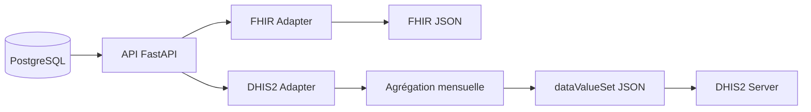

# Exemples FHIR R4 et DHIS2

## Vue d'ensemble

Ce document présente les exemples de mapping entre:
- Le modèle de données interne de Santé Rurale Mali
- Les ressources FHIR R4 (interopérabilité)
- Les dataValueSets DHIS2 (rapportage)

---

## 1. FHIR R4 - Ressources supportées

### 1.1 Patient

**Mapping**: Table `patients` → FHIR Patient

**Exemple JSON**:

```json
{
  "resourceType": "Patient",
  "id": "550e8400-e29b-41d4-a716-446655440000",
  "meta": {
    "versionId": "1",
    "lastUpdated": "2024-04-20T10:30:00Z",
    "source": "https://api.sante-rurale.ml"
  },
  "identifier": [
    {
      "use": "official",
      "system": "https://sante-rurale.ml/patients",
      "value": "550e8400-e29b-41d4-a716-446655440000"
    }
  ],
  "active": true,
  "name": [
    {
      "use": "official",
      "family": "Sanogo",
      "given": ["Diara"]
    }
  ],
  "telecom": [
    {
      "system": "phone",
      "value": "+223 70 12 34 56",
      "use": "mobile"
    }
  ],
  "gender": "female",
  "birthDate": "1978",
  "_birthDate": {
    "extension": [
      {
        "url": "http://hl7.org/fhir/StructureDefinition/patient-birthTime",
        "valueDateTime": "1978-01-01"
      }
    ]
  },
  "address": [
    {
      "use": "home",
      "text": "Konobougou",
      "city": "Konobougou",
      "district": "Ségou",
      "country": "ML"
    }
  ],
  "managingOrganization": {
    "reference": "Organization/cscom-konobougou",
    "display": "CSCOM Konobougou"
  }
}
```

---

### 1.2 Encounter (Consultation)

**Mapping**: Table `encounters` → FHIR Encounter

**Exemple JSON**:

```json
{
  "resourceType": "Encounter",
  "id": "enc-123abc",
  "meta": {
    "versionId": "1",
    "lastUpdated": "2024-04-20T14:45:00Z"
  },
  "status": "finished",
  "class": {
    "system": "http://terminology.hl7.org/CodeSystem/v3-ActCode",
    "code": "AMB",
    "display": "ambulatory"
  },
  "type": [
    {
      "coding": [
        {
          "system": "http://snomed.info/sct",
          "code": "185349003",
          "display": "Encounter for 'check-up'"
        }
      ],
      "text": "Consultation générale"
    }
  ],
  "subject": {
    "reference": "Patient/550e8400-e29b-41d4-a716-446655440000",
    "display": "Sanogo Diara"
  },
  "participant": [
    {
      "type": [
        {
          "coding": [
            {
              "system": "http://terminology.hl7.org/CodeSystem/v3-ParticipationType",
              "code": "PPRF",
              "display": "primary performer"
            }
          ]
        }
      ],
      "individual": {
        "reference": "Practitioner/user-456def",
        "display": "Dr. Coulibaly Amadou"
      }
    }
  ],
  "period": {
    "start": "2024-04-20T14:00:00Z",
    "end": "2024-04-20T14:45:00Z"
  },
  "reasonCode": [
    {
      "text": "Fièvre et maux de tête"
    }
  ],
  "serviceProvider": {
    "reference": "Organization/cscom-konobougou"
  }
}
```

---

### 1.3 Condition (Diagnostic)

**Mapping**: Table `conditions` → FHIR Condition

**Exemple JSON**:

```json
{
  "resourceType": "Condition",
  "id": "cond-789xyz",
  "meta": {
    "lastUpdated": "2024-04-20T14:45:00Z"
  },
  "clinicalStatus": {
    "coding": [
      {
        "system": "http://terminology.hl7.org/CodeSystem/condition-clinical",
        "code": "active",
        "display": "Active"
      }
    ]
  },
  "verificationStatus": {
    "coding": [
      {
        "system": "http://terminology.hl7.org/CodeSystem/condition-ver-status",
        "code": "confirmed",
        "display": "Confirmed"
      }
    ]
  },
  "code": {
    "coding": [
      {
        "system": "http://hl7.org/fhir/sid/icd-10",
        "code": "A00.9",
        "display": "Paludisme, non précisé"
      }
    ],
    "text": "Paludisme"
  },
  "subject": {
    "reference": "Patient/550e8400-e29b-41d4-a716-446655440000"
  },
  "encounter": {
    "reference": "Encounter/enc-123abc"
  },
  "onsetDateTime": "2024-04-20",
  "recordedDate": "2024-04-20T14:45:00Z",
  "recorder": {
    "reference": "Practitioner/user-456def"
  }
}
```

---

### 1.4 MedicationRequest (Ordonnance)

**Mapping**: Table `medication_requests` → FHIR MedicationRequest

**Exemple JSON**:

```json
{
  "resourceType": "MedicationRequest",
  "id": "medr-001abc",
  "meta": {
    "lastUpdated": "2024-04-20T14:50:00Z"
  },
  "status": "active",
  "intent": "order",
  "medicationCodeableConcept": {
    "text": "Artésunate 100 mg"
  },
  "subject": {
    "reference": "Patient/550e8400-e29b-41d4-a716-446655440000"
  },
  "encounter": {
    "reference": "Encounter/enc-123abc"
  },
  "authoredOn": "2024-04-20T14:50:00Z",
  "requester": {
    "reference": "Practitioner/user-456def"
  },
  "dosageInstruction": [
    {
      "text": "1-0-1 pendant 3 jours",
      "timing": {
        "repeat": {
          "frequency": 2,
          "period": 1,
          "periodUnit": "d",
          "duration": 3,
          "durationUnit": "d"
        }
      },
      "route": {
        "coding": [
          {
            "system": "http://snomed.info/sct",
            "code": "26643006",
            "display": "Oral route"
          }
        ]
      },
      "doseAndRate": [
        {
          "doseQuantity": {
            "value": 100,
            "unit": "mg",
            "system": "http://unitsofmeasure.org",
            "code": "mg"
          }
        }
      ]
    }
  ],
  "dispenseRequest": {
    "numberOfRepeatsAllowed": 0,
    "quantity": {
      "value": 6,
      "unit": "comprimé",
      "system": "http://unitsofmeasure.org",
      "code": "{comprimé}"
    }
  }
}
```

---

## 2. DHIS2 - DataValueSets

### 2.1 Mapping Data Elements

**Périmètre**: Export mensuel des consultations et diagnostics vers DHIS2

**Data Elements** (exemples):

| Data Element | Code | Description | Type |
|--------------|------|-------------|------|
| Total consultations | CONS_TOTAL | Nombre total de consultations | NUMBER |
| Consultations < 5 ans | CONS_U5 | Consultations enfants < 5 ans | NUMBER |
| Cas de paludisme | DIAG_PALU | Nombre de cas de paludisme confirmés | NUMBER |
| Cas de diarrhée | DIAG_DIAR | Nombre de cas de diarrhée | NUMBER |
| Références | REF_TOTAL | Nombre de références vers hôpital | NUMBER |

### 2.2 Exemple dataValueSet (Payload)

**POST** `https://dhis2.sante.gov.ml/api/dataValueSets`

```json
{
  "dataSet": "PHCREP_MONTHLY",
  "completeDate": "2024-04-30",
  "period": "202404",
  "orgUnit": "OU_CSCOM_KONOBOUGOU",
  "attributeOptionCombo": "default",
  "dataValues": [
    {
      "dataElement": "CONS_TOTAL",
      "categoryOptionCombo": "default",
      "value": "456",
      "comment": "Consultations totales Avril 2024"
    },
    {
      "dataElement": "CONS_U5",
      "categoryOptionCombo": "default",
      "value": "123",
      "comment": "Consultations < 5 ans"
    },
    {
      "dataElement": "DIAG_PALU",
      "categoryOptionCombo": "default",
      "value": "89",
      "comment": "Cas de paludisme confirmés (CIM-10: A00.9)"
    },
    {
      "dataElement": "DIAG_DIAR",
      "categoryOptionCombo": "default",
      "value": "34",
      "comment": "Cas de diarrhée"
    },
    {
      "dataElement": "DIAG_PNEUM",
      "categoryOptionCombo": "default",
      "value": "23",
      "comment": "Pneumonies"
    },
    {
      "dataElement": "REF_TOTAL",
      "categoryOptionCombo": "default",
      "value": "12",
      "comment": "Références vers hôpital de Ségou"
    },
    {
      "dataElement": "NEWBORN_VISITS",
      "categoryOptionCombo": "default",
      "value": "45",
      "comment": "Visites néonatales"
    }
  ]
}
```

### 2.3 Réponse DHIS2 (Succès)

```json
{
  "status": "SUCCESS",
  "description": "Import process completed successfully",
  "importCount": {
    "imported": 7,
    "updated": 0,
    "ignored": 0,
    "deleted": 0
  },
  "conflicts": [],
  "dataSetComplete": "202404"
}
```

### 2.4 Validation avant export

**Règles de validation** (à implémenter côté API):

```python
# Pseudo-code
def validate_dhis2_export(period: str, site_id: UUID) -> ValidationResult:
    """
    Valide les données avant export DHIS2
    """
    errors = []

    # 1. Vérifier que la période est complète (mois terminé)
    if period >= current_month():
        errors.append("La période doit être un mois révolu")

    # 2. Vérifier que les data elements existent
    for data_element in data_values:
        if not dhis2_client.data_element_exists(data_element.code):
            errors.append(f"Data element inconnu: {data_element.code}")

    # 3. Vérifier que l'organisation unit existe
    if not dhis2_client.org_unit_exists(site.dhis2_org_unit_id):
        errors.append(f"Organisation unit inconnue: {site.dhis2_org_unit_id}")

    # 4. Vérifier les valeurs (nombres positifs, etc.)
    for value in data_values:
        if value.value < 0:
            errors.append(f"Valeur négative: {value.data_element}")

    return ValidationResult(valid=len(errors) == 0, errors=errors)
```

---

## 3. Mapping Complet : Base → FHIR → DHIS2

### 3.1 Workflow d'export



### 3.2 Exemple d'agrégation

**Requête SQL** pour générer les données DHIS2:

```sql
-- Export DHIS2 pour période 202404, site CSCOM Konobougou
SELECT
    COUNT(*) AS total_consultations,
    COUNT(*) FILTER (
        WHERE EXTRACT(YEAR FROM NOW()) - p.annee_naissance < 5
    ) AS consultations_u5,
    COUNT(*) FILTER (
        WHERE c.code_icd10 = 'A00.9'
    ) AS cas_paludisme,
    COUNT(*) FILTER (
        WHERE c.code_icd10 LIKE 'A09%'
    ) AS cas_diarrhee,
    COUNT(DISTINCT r.id) AS references_total
FROM encounters e
JOIN patients p ON e.patient_id = p.id
LEFT JOIN conditions c ON c.encounter_id = e.id
LEFT JOIN references r ON r.encounter_id = e.id
WHERE
    e.site_id = 'uuid-cscom-konobougou'
    AND e.date >= '2024-04-01'
    AND e.date < '2024-05-01'
    AND e.deleted_at IS NULL;
```

---

## 4. Code d'implémentation

### 4.1 FHIR Adapter (Python)

```python
from fhir.resources.patient import Patient as FHIRPatient
from fhir.resources.encounter import Encounter as FHIREncounter

def patient_to_fhir(patient: Patient) -> FHIRPatient:
    """Convertit un patient DB en ressource FHIR Patient"""
    return FHIRPatient.construct(
        id=str(patient.id),
        meta={
            "versionId": str(patient.version),
            "lastUpdated": patient.updated_at.isoformat(),
        },
        identifier=[{
            "system": "https://sante-rurale.ml/patients",
            "value": str(patient.id),
        }],
        name=[{
            "family": patient.nom,
            "given": [patient.prenom] if patient.prenom else [],
        }],
        gender="female" if patient.sexe == "F" else "male",
        birthDate=str(patient.annee_naissance) if patient.annee_naissance else None,
        telecom=[{
            "system": "phone",
            "value": patient.telephone,
        }] if patient.telephone else [],
        address=[{
            "text": patient.village,
        }] if patient.village else [],
    )
```

### 4.2 DHIS2 Exporter (Python)

```python
async def export_to_dhis2(period: str, site_id: UUID):
    """
    Exporte les données agrégées vers DHIS2
    """
    # 1. Agréger les données
    data = await aggregate_data_for_period(period, site_id)

    # 2. Construire le payload
    payload = {
        "dataSet": settings.DHIS2_DATASET_ID,
        "period": period,
        "orgUnit": site.dhis2_org_unit_id,
        "dataValues": [
            {"dataElement": "CONS_TOTAL", "value": str(data.total_consultations)},
            {"dataElement": "CONS_U5", "value": str(data.consultations_u5)},
            {"dataElement": "DIAG_PALU", "value": str(data.cas_paludisme)},
            # ... autres data elements
        ]
    }

    # 3. Valider
    validation = validate_dhis2_payload(payload)
    if not validation.valid:
        raise ValueError(f"Validation DHIS2 échouée: {validation.errors}")

    # 4. Envoyer à DHIS2
    async with httpx.AsyncClient() as client:
        response = await client.post(
            f"{settings.DHIS2_BASE_URL}/api/dataValueSets",
            json=payload,
            auth=(settings.DHIS2_USERNAME, settings.DHIS2_PASSWORD),
            timeout=30.0
        )
        response.raise_for_status()
        return response.json()
```

---

## 5. Références

- **FHIR R4**: https://hl7.org/fhir/R4/
- **DHIS2 API**: https://docs.dhis2.org/en/develop/using-the-api/dhis-core-version-master/data.html
- **CIM-10**: https://www.who.int/standards/classifications/classification-of-diseases
